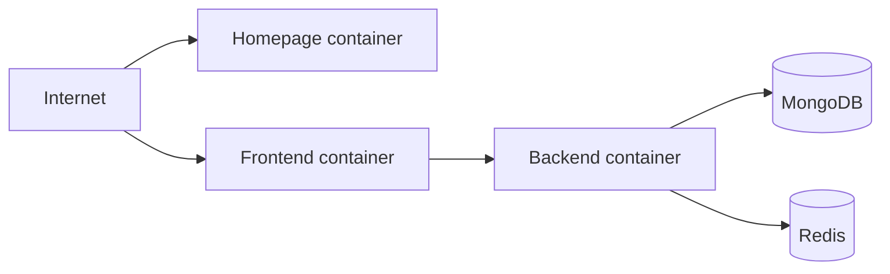

# SoloSync production deployment

This deployment layer runs the homepage, frontend and backend as portable containers while MongoDB and Redis remain external managed services.

## Required variables

IMAGE_REGISTRY, FRONTEND_IMAGE, BACKEND_IMAGE, HOME_IMAGE, MONGODB_URI, REDIS_URL, JWT_SECRET, FRONTEND_ORIGIN.

## Recommended production topology

The same images can be deployed to Azure Container Apps, GCP Cloud Run and OCI Container Instances. Current provider documentation confirms these services support containerized web/API workloads. Do not put database credentials into git.