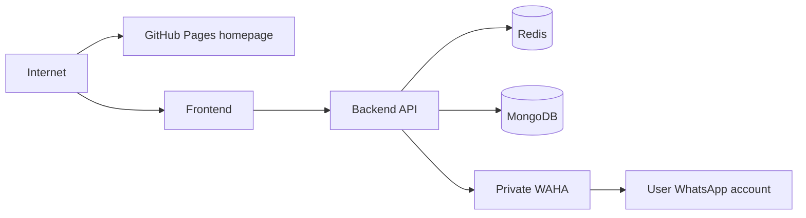

# SoloSync production deployment

The deployment layer runs the homepage, frontend, backend and a private WAHA service. MongoDB and Redis remain external managed services.

## Recommended MVP topology

The user pairs their own WhatsApp account with a dedicated WAHA session. WAHA session state is persisted on a volume so a restart does not require pairing again.

## Compose

Create `solosync/.env` from `solosync/.env.example`, then run:

    docker compose -f docker-compose.prod.yml -f waha-compose.yml up -d

The second compose file adds the persistent WAHA service to the same Compose network. The backend reaches it at `http://waha:3000`.

Keep WAHA private. Do not publish port 3000 to the internet. Protect its API with `WAHA_API_KEY`.

## Billing test mode

The product pricing is configured as:

- ₹399 one-time activation for the first connected account.
- ₹0.10 for each successfully published message.

Set `BILLING_ENABLED=false` while testing. The backend records ledger entries but does not call a payment provider.

## Production

Use a persistent host for WAHA storage. The homepage is now a dependency-free `index.html` suitable for GitHub Pages; it no longer needs a container.

For cloud-managed frontend/backend deployments, deploy WAHA separately on a private VM/container host with persistent storage and allow only the backend network to reach it.
